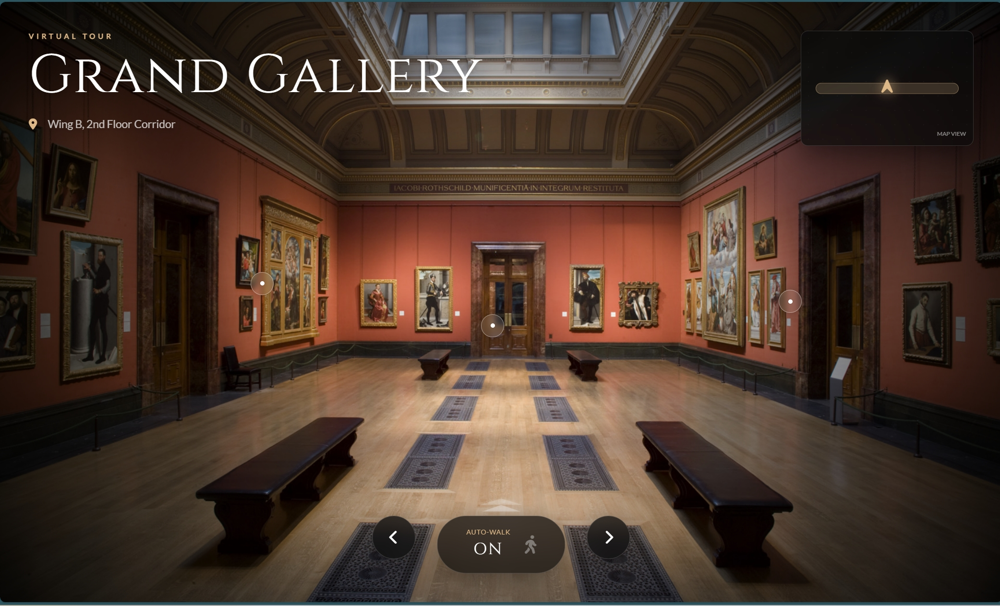
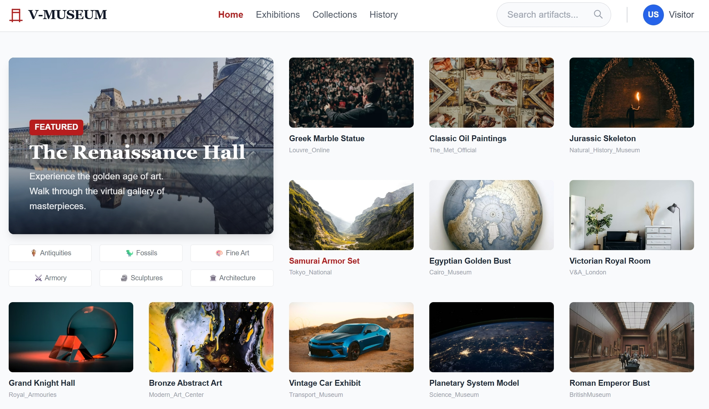
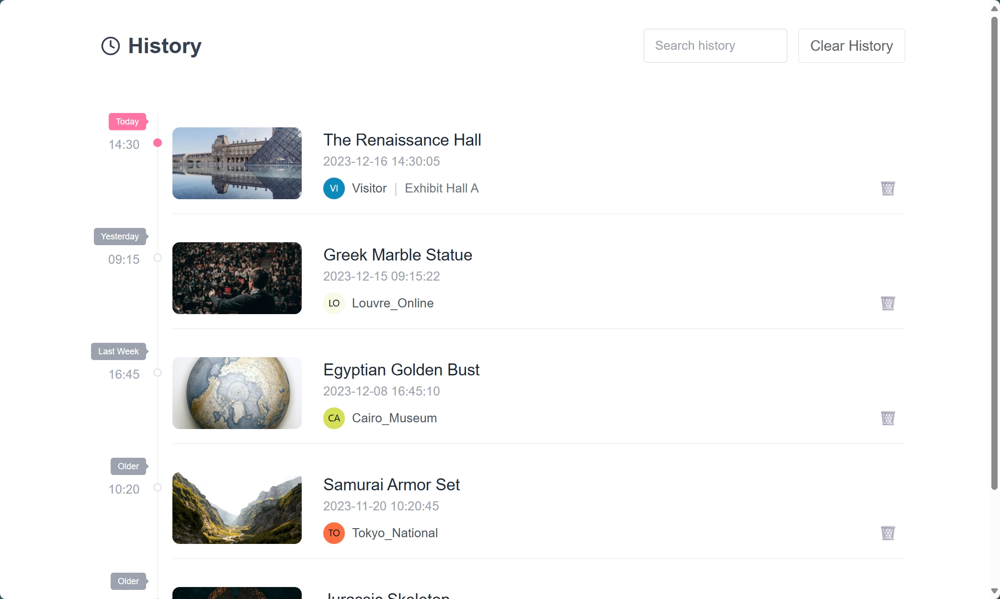

# Virtual Museum Online Platform FrontEnd
# 🏛️ V-Museum - AI-Powered Immersive Virtual Museum

   

**V-Museum** is a next-generation digital exhibition platform that leverages **Luma AI** to bridge the physical and digital worlds. By partnering with museums, we transform standard exhibit walkthrough videos into high-fidelity interactive 3D scenes. Users can explore these spaces seamlessly via a web browser, complete with spatial audio and interactive learning points.

> **Core Concept:** "Upload a video, generate a world."

## ✨ Key Features

### 1. 🔮 AI-Generated 3D Environments (Luma AI Integration)
Instead of manual 3D modeling, we utilize the **Luma AI API** to reconstruct photorealistic 3D scenes from video footage.
- **Workflow:** Curators/partners upload a video scan of a physical room -> Luma API processes the NeRF/Gaussian Splatting data -> The frontend renders the interactive 3D environment.
- **High Fidelity:** Captures complex lighting and textures that traditional modeling often misses.

### 2. 🧭 Immersive Navigation & Teleportation
A seamless exploration experience designed for web performance.
- **Teleportation Points:** Users can click on "Portals" within the 3D scene to instantly load and transition to different exhibition halls (scene switching).
- **Free Roam:** Mouse/Touch controls to look around and move within the current scene.



### 3. ℹ️ Interactive Info Hotspots
Turns a visual tour into an educational experience.
- **Dynamic POIs:** Clicking on specific artifacts triggers an overlay card displaying historical context, metadata, and high-res imagery.
- **3D Space Anchoring:** Info buttons remain fixed relative to the artifact as the user moves the camera.

### 4. 🎧 Adaptive Spatial Audio (Ambience)
Enhancing immersion through sound.
- **Context-Aware Audio:** The background music and ambient sounds automatically fade and switch based on the current room (e.g., *Classical Orchestral* for the Renaissance Hall, *Nature Ambience* for the Fossil Exhibit).

### 5. 🏠 User Dashboard & History
- **Personalized Journey:** Tracks visited halls and viewed artifacts visually on a timeline.
- **Discovery:** A rich homepage to browse trending exhibitions and featured collections.

| Discovery Dashboard | Visit History |
| :---: | :---: |
|  |  |

## 🛠️ Technical Highlights (Frontend)

### 3D Rendering Engine
- Built with **React Three Fiber (R3F)** and **Three.js**.
- Implemented **Level of Detail (LOD)** loading to ensure smooth performance when rendering complex Luma AI models in the browser.

### Scene Management System
- **State Management:** Uses Redux to track current `SceneID`, `AudioTrack`, and `UserPosition`.
- **Audio Engine:** Developed a custom hook `useSceneAudio` that listens to scene changes and performs cross-fading between audio tracks to prevent jarring sound cuts.

### Interaction Logic
```javascript
// Conceptual logic for Teleportation
const handleTeleport = (targetSceneId) => {
  // 1. Fade out current audio
  audioController.fadeOut();
  
  // 2. Trigger transition animation
  setTransitionState('loading');
  
  // 3. Load new Luma Model & Metadata
  loadSceneAssets(targetSceneId).then(() => {
    // 4. Update Redux & Fade in new ambience
    dispatch(switchScene(targetSceneId));
    audioController.play(scenes[targetSceneId].bgm);
  });
};
