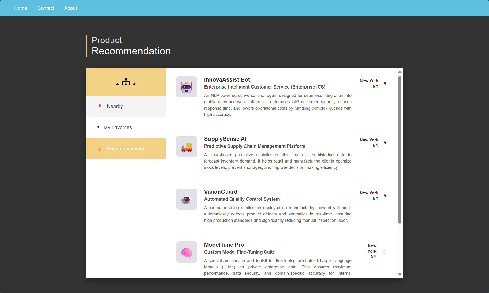

# Personalized-Software-Services-Sales-Recommendation-System-FrontEnd

## 📖 Introduction

This repository contains the **frontend source code** for the Product Recommendation System. It is a responsive, single-page application (SPA) designed to provide users with an intuitive interface for discovering AI tools and enterprise software.

The project focuses on a clean UI/UX, seamless user interactions, and efficient data visualization using modern web standards (HTML5, CSS3, and Vanilla JavaScript).

---

## 📸 UI Showcase & Features

### 1. User Authentication
A streamlined onboarding process featuring secure form validation and responsive layouts. Users can easily toggle between logging in and creating a new account to build their personalization profile.

| Login Interface | Registration Interface |
| :---: | :---: |
|  |  |
| *Clean, distraction-free login form* | *User profile creation with validation* |

### 2. Recommendation Dashboard
The core of the application. This dashboard visualizes complex product data in easy-to-read cards. It features:
* **Tabbed Navigation:** Switch between "Nearby" products and "Recommended" items.
* **Interactive Cards:** Each card displays the product logo, title, description, and location.
* **Favorite System:** Users can save items to their personal list using the heart icon (♥).

---

## 🛠 Tech Stack

This project is built with a lightweight, dependency-free approach to ensure maximum performance and compatibility.

| Component | Technology | Description |
| :--- | :--- | :--- |
| **Structure** | **HTML5** | Semantic markup for accessibility and SEO. |
| **Styling** | **CSS3** | Custom implementation using Flexbox and CSS Grid for layout; no heavy frameworks (like Bootstrap) required. |
| **Logic** | **JavaScript (ES6+)** | Handles DOM manipulation, event listeners, and API state management. |
| **Networking** | **Fetch API / AJAX** | Asynchronous communication with backend endpoints for seamless data loading. |
| **Assets** | **SVG & FontAwesome** | scalable vector icons for UI elements. |

---

## 🚀 Key Frontend Features

* **Responsive Design:** The layout automatically adjusts for desktops, tablets, and mobile devices using CSS Media Queries.
* **Dynamic DOM Manipulation:** Product cards are generated programmatically based on JSON data, allowing for real-time updates without page reloads.
* **Interactive UI Elements:**
    * Hover effects on product cards.
    * Instant feedback on form submission (Success/Error messages).
    * Active state toggling for navigation tabs.
* **Asynchronous Data Loading:** Utilizes `async/await` patterns to fetch product data in the background, keeping the UI responsive.

---

